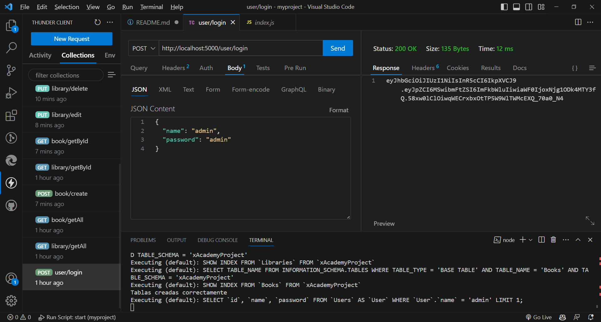

**Correr XAMPP**
Crear una base de datos con el nombre definido en el archivo de entorno (DATABASE)
Definir las variables del archivo .env

**package.json**
Configuramos para que corra el archivo src/index.js con node. 

**index.js**
al ejecutar el mismo, se crean las tablas "libraries", "books" y "users". Además, se crea (si es que no existe) automáticamente un usuario "admin" con contraseña "admin". 

**src/db/sequelize-config.js**
Aquí se encuentra la configuración de la base de datos. Se deben definir las variables de entorno

**src/auth/auth**
Inicializamos la autenticación

**src/auth/passport-config.js**
Aquí se encuentra la configuración de passport, cuya secret key la definimos como "ClaveUltraSecreta". Ésto nos permitirá autenticarnos con un nombre y una contraseña y consultando a la base de datos la existencia de dicho usuario. Además, verificará el token de seguridad que le pasamos por el header.

**src/middlewares/authentication**
Este middleware se encargará de autenticar al usuario antes de hacer una operación en las rutas /library y /book que requieran modificar, eliminar o crear una librería o libro.

**src/middlewares/error-handler**
Aquí se manejan los errores que se generen en los catch

**src/exceptions/user-exceptions.js**
Aquí se crean las clases NotFound y NotAuthorized que serán los errores utilizados en caso de que el libro o librería no se encuentre en la base de datos, y cuando el usuario no se haya autenticado, respectivamente

**src/models**
Creamos los modelos Book, Library, y User que serán las tablas de la base de datos

**/user**
En la ruta /user/login, podemos loguearnos usando passport y obtenemos en pantalla el token el cual debemos copiarlo y pegarlo en el header de la consulta, con la key "Authorization". 

**src/assets/postman.json**
Podemos importar desde nuestra cuenta en Postman este archivo donde ya se encuentran todas las consultas.

**Testing**

book/create --> crear un libro cuyo LibraryId no existe
book/create --> crear un libro cuyo isbn ya existe
book/getById--> consultar un libro que no existe 
book/edit --> editar un libro que no existe
book/edit --> editar el isbn de un libro que ya existe
book/edit --> editar el LibraryId de un libro a un id de Library inexistente
book/delete --> borrar un libro que no existe
library/getById --> consultar una librería que no existe
library/edit --> editar una librería inexistente
library/delete --> borrar una librería inexistente
library/addBook --> crear un libro cuyo LibraryId no exista
library/addBook --> crear un libro cuyo isbn ya existe
